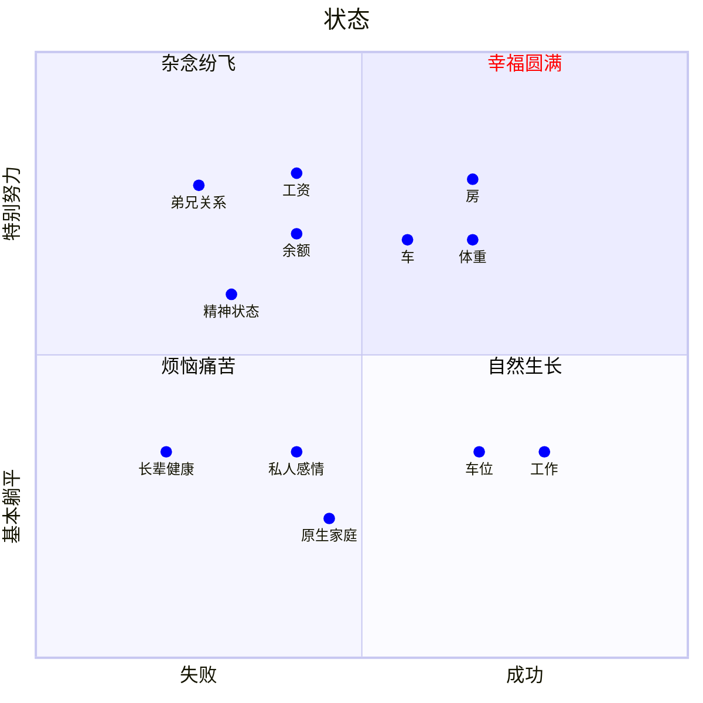
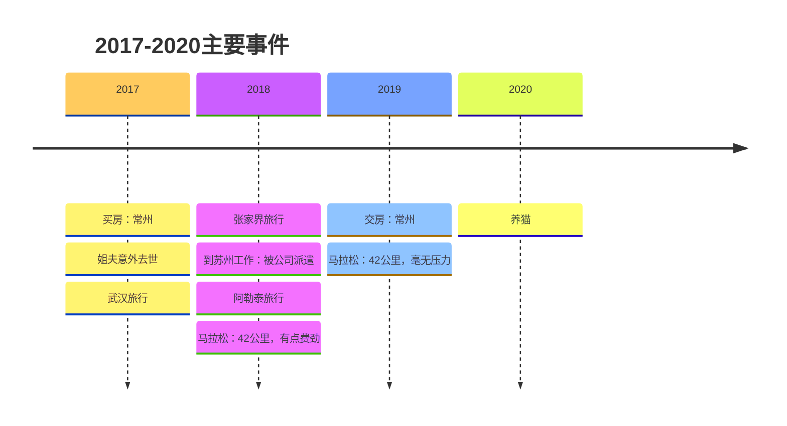
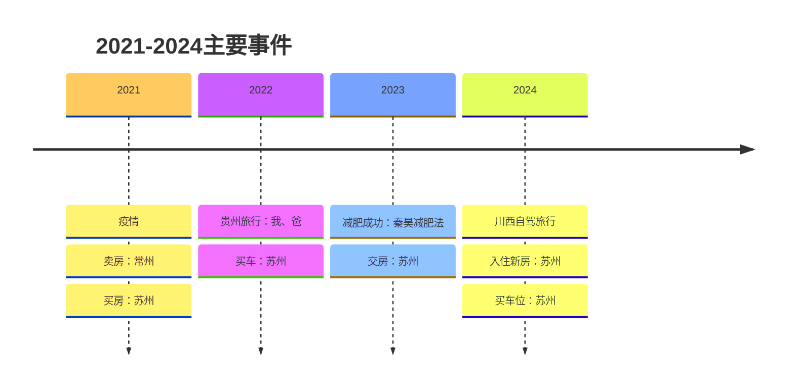

> **苟**
> 2024，就先苟着吧

## 状态

```mermaid
%%{init: {"quadrantChart": {"chartWidth": 600, "chartHeight": 600, "pointTextPadding": 10}, "themeVariables": {"quadrant1TextFill": "#ff0000", "quadrantPointFill": "#0000ff"} }}%%
quadrantChart
    title 状态
    x-axis "失败" --> "成功"
    y-axis "基本躺平" --> "特别努力"
    quadrant-1 "幸福圆满"
    quadrant-2 "杂念纷飞"
    quadrant-3 "烦恼痛苦"
    quadrant-4 "自然生长"
    "精神状态": [0.3, 0.6]
    "工资": [0.4, 0.8]
    "余额": [0.4, 0.7]
    "原生家庭": [0.45, 0.23]
    "房": [0.67, 0.79]
    "车": [0.57, 0.69]
    "体重": [0.67, 0.69]
    "工作": [0.78, 0.34]
    "车位": [0.68, 0.34]
    "私人感情": [0.40, 0.34]
    "长辈健康": [0.20, 0.34]
    "弟兄关系": [0.25, 0.78]

```

## 事件

```mermaid
%%{init: { 'theme': 'base' } }%%
timeline
    title 2017-2020主要事件
    2017 : 买房：常州
         : 姐夫意外去世
         : 武汉旅行
    2018 : 张家界旅行
         : 到苏州工作：被公司派遣
         : 阿勒泰旅行
         : 马拉松：42公里，有点费劲
    2019 : 交房：常州
         : 马拉松：42公里，毫无压力
    2020 : 养猫

```

```mermaid
%%{init: { 'theme': 'base' } }%%
timeline
    title 2021-2024主要事件
    2021 : 疫情
         : 卖房：常州
         : 买房：苏州
    2022 : 贵州旅行：我、爸
         : 买车：苏州
    2023 : 减肥成功：秦昊减肥法
         : 交房：苏州
    2024 : 川西自驾旅行
         : 入住新房：苏州
         : 买车位：苏州

```
